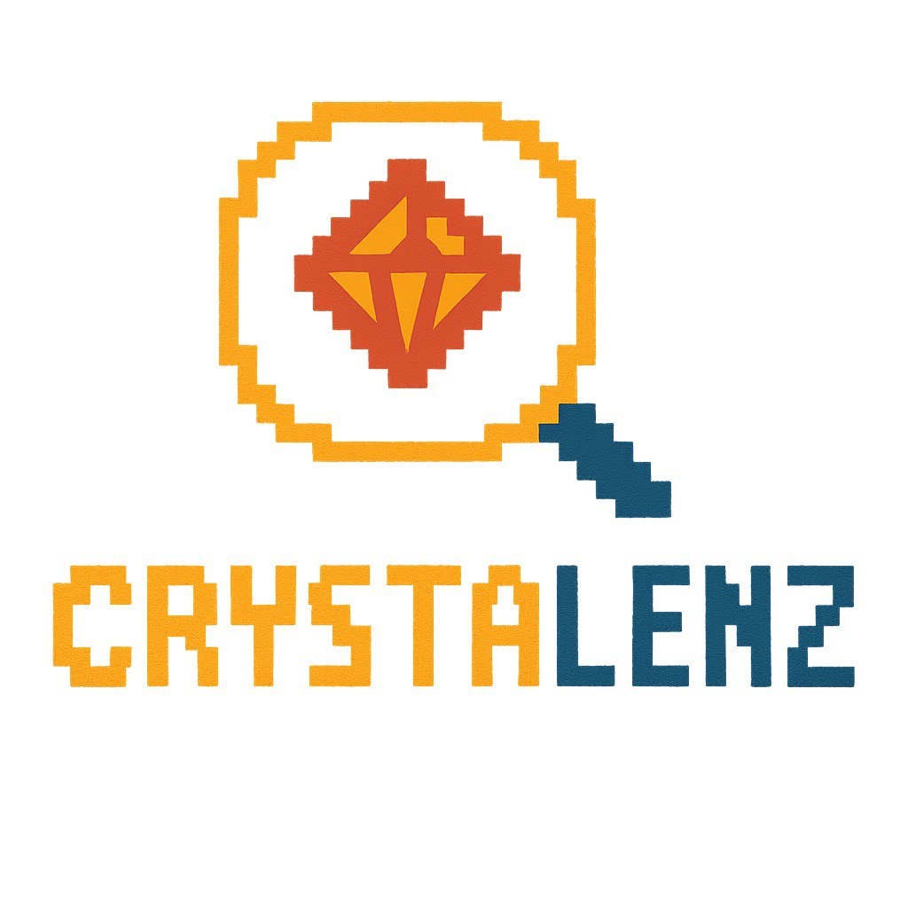
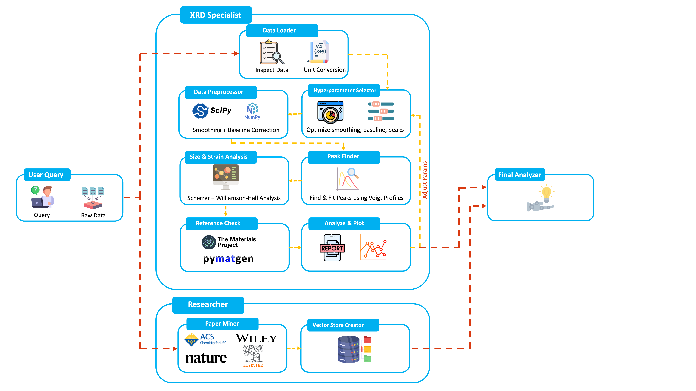

<p align="center">
  
</p>

CrystaLens is an AI-assisted workflow for X-ray diffraction (XRD) analysis. It combines an agentic backend (Starlette + Google ADK) with a modern Next.js web UI. The system can:

- **Run an end-to-end XRD pipeline**: load and preprocess data, detect peaks, compute Scherrer/Williamson–Hall size/strain, cross-check against Materials Project references, and generate plots/reports.
- **Mine research papers**: search Google Programmable Search (CSE), download PDFs, and extract text for quick literature triage.
- **RAG (Retrieval-Augmented Generation)**: build a FAISS vector database from extracted paper texts using OpenAI embeddings, then semantically retrieve the most relevant chunks to augment agent responses with cited, evidence-based context.
- Stream results to the web UI as the pipeline progresses.

<p align="center">
  
</p>

---

## Quick start

### Prerequisites

- Python 3.11+
- Node.js 20+ and pnpm (or npm/yarn)

### 1) Backend (API)

```bash
cd backend
python3 -m venv .venv && source .venv/bin/activate
pip install -r ../requirements.txt
# Install project in editable mode (enables clean imports)
pip install -e ..

# Run the API
uvicorn app.main:app --reload --host 0.0.0.0 --port 8000
```

The API exposes:

- POST `/api/runs` → returns `{ "run_id": string }`
- WebSocket `/api/runs/{run_id}/stream` → server-sent JSON events: `status | event | error | done`
- Static artifacts: `/xrd_outputs/*` serves generated plots from `xrd_outputs/`

### 2) Web (UI)

```bash
cd web
pnpm i   # or npm i / yarn

# Optional: configure env (defaults shown)
# NEXT_PUBLIC_API_HTTP=http://localhost:8000
# NEXT_PUBLIC_API_WS=ws://localhost:8000

pnpm dev
```

Open the UI at http://localhost:3000

---

## Environment variables

Create a `.env` at the project root for Python tools that call `dotenv.load_dotenv()`.

```bash
# Research paper mining (Google Programmable Search)
GOOGLE_CSE_API_KEY=...
GOOGLE_CSE_ID=...

# Materials Project (XRD reference patterns)
MP_API_KEY=...

# RAG embeddings (OpenAI text-embedding-3-large)
OPENAI_API_KEY=...

# Optional – model providers used by google-adk/google-genai
# GOOGLE_API_KEY=...
# GOOGLE_GENAI_API_KEY=...
```

Notes:

- Paper search requires both `GOOGLE_CSE_API_KEY` and `GOOGLE_CSE_ID`.
- RAG vector store creation requires `OPENAI_API_KEY` (for `text-embedding-3-large` embeddings).
- Materials Project lookups require `MP_API_KEY`.
- Static plot export uses Plotly + Kaleido (already in `requirements.txt`).

---

## How it works

### High-level architecture

- Backend: Starlette app (`backend/app/main.py`) that adapts the agent runtime to simple HTTP + WS endpoints. It streams agent events to the UI and serves generated artifacts.
- Agents: Defined with Google ADK in `src/`. The top-level `root_agent` orchestrates a research and XRD pipeline, followed by a final analysis stage.
- Web UI: Next.js 14 app in `web/`, with a small console interface that posts a prompt, then receives streaming events and renders plots/links.

### Agent graph (simplified)

- `root_agent` (`src/agent.py`)
  - `sequential_pipeline_agent`
    - `parallel_research_analysis_agent`
      - `research_specialist_agent` (paper mining)
      - `xrd_specialist_agent` (XRD pipeline)
    - `final_analizer_agent`

- XRD pipeline (`src/agents/xrd_agent/agent.py`)
  - `data_loader_agent` → `xrd_hyperparameter_optimizer_pipeline` (loop, max_iterations=1)
    - `hyperparameter_optimizer_agent`
    - `xrd_analysis_pipeline`:
      - `data_preprocessor_agent`
      - `peak_finder_agent`
      - `scherrer_and_wh_agent`
      - `reference_check_agent` (Materials Project)
      - `reporter_agent` (Plotly export to `xrd_outputs/`)

- Paper miner (`src/agents/research_agent/sub_agents/paper_miner/`)
  - `search_papers.py` → Google CSE (requires `GOOGLE_CSE_*`)
  - `download_pdfs.py` → downloads to `papers/downloaded_pdfs/`
  - `extract_texts_from_pdfs.py` → saves text to `papers/extracted_texts/`

- RAG pipeline (`src/agents/research_agent/sub_agents/retriever/`)
  - `create_vector_store.py` → chunks extracted texts (1200 chars, 200 overlap), embeds with OpenAI `text-embedding-3-large`, L2-normalizes, and stores in a FAISS `IndexFlatIP` index at `papers/vector_store/`
  - `retrieve_data.py` → embeds the user query with the same model, searches the FAISS index for top-k similar chunks, and returns ranked results with source metadata and similarity scores

---

## Using the system

### From the Web UI

- Navigate to the console page and enter a prompt, for example:
  - “Analyze XRD file at sample_data/sample_xrd.csv and compare with Si (mp-149).”
  - “Find recent PDFs about V2O5 XRD peak shifts filetype:pdf 2023..NOW.”
- The UI opens a run, then streams events in real time. Plots appear under `xrd_outputs/` and are linked in the stream.

### Direct API usage

1. Create a run

```bash
curl -s -X POST http://localhost:8000/api/runs -H 'Content-Type: application/json' \
  -d '{"input":"Analyze sample_data/sample_xrd.csv vs Si (mp-149)"}'
```

2. Connect a WebSocket client to `/api/runs/{run_id}/stream` and process events until `done`.

---

## Project structure (selected)

```
CrystaLens/
├── backend/
│   └── app/main.py                # Starlette app: HTTP + WebSocket streaming, serves xrd_outputs
├── src/
│   ├── agent.py                   # root_agent wiring (Google ADK)
│   ├── agents/
│   │   ├── xrd_agent/             # XRD pipeline agents, tools, prompts
│   │   └── research_agent/        # Paper miner agents, tools, prompts
│   ├── data_store/                # In-memory store for XRD runs
│   └── schemas/                   # Shared schemas
├── web/                           # Next.js 14 UI
├── papers/                        # Downloaded PDFs, extracted texts, and FAISS vector store
├── sample_data/                   # Example XRD CSVs
├── xrd_outputs/                   # Generated HTML/PNG plots and reports
└── tests/                         # Pytests for XRD tools
```

---

## Testing

```bash
# from repo root
python -m venv .venv && source .venv/bin/activate
pip install -r requirements.txt
pytest -q
```

---

## Troubleshooting

- Can’t fetch Materials Project references: ensure `MP_API_KEY` is set and valid.
- Paper search returns error: set `GOOGLE_CSE_API_KEY` and `GOOGLE_CSE_ID` in `.env`.
- Vector store creation fails: ensure `OPENAI_API_KEY` is set (used for embedding generation).
- WebSocket not connecting: confirm the UI `NEXT_PUBLIC_API_WS` matches your backend URL/port.
- Static image export fails: ensure `kaleido` is installed (included) and the process has write access to `xrd_outputs/`.

---

## Tech stack

- Backend: Python, Starlette, Uvicorn, Pydantic, Google ADK, google-genai
- XRD: NumPy, SciPy, lmfit, pymatgen, mp-api
- Visualization: Plotly + Kaleido
- RAG: FAISS (faiss-cpu), OpenAI Embeddings (text-embedding-3-large), NumPy
- Research miner: requests, PyMuPDF (fitz)
- Frontend: Next.js 14, React 18, SWR, Tailwind CSS

---

## License

This project is licensed under the MIT License. See the [LICENSE](LICENSE) file for details.

---

## Acknowledgements

- Materials Project and `pymatgen` for structures and diffraction simulation.
- Plotly for interactive and static plotting.
- Google ADK for the agent orchestration runtime.
- Meta FAISS for vector similarity search.
- OpenAI for embedding generation.
